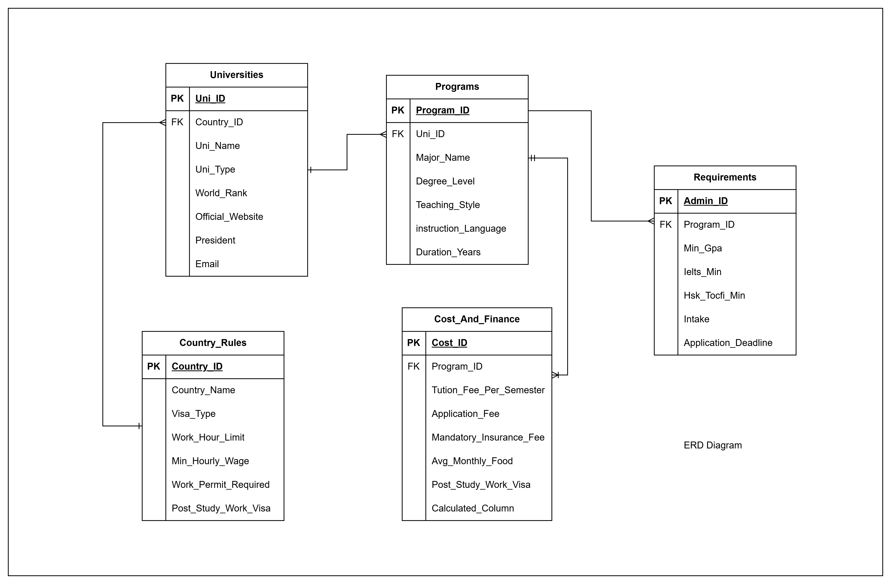
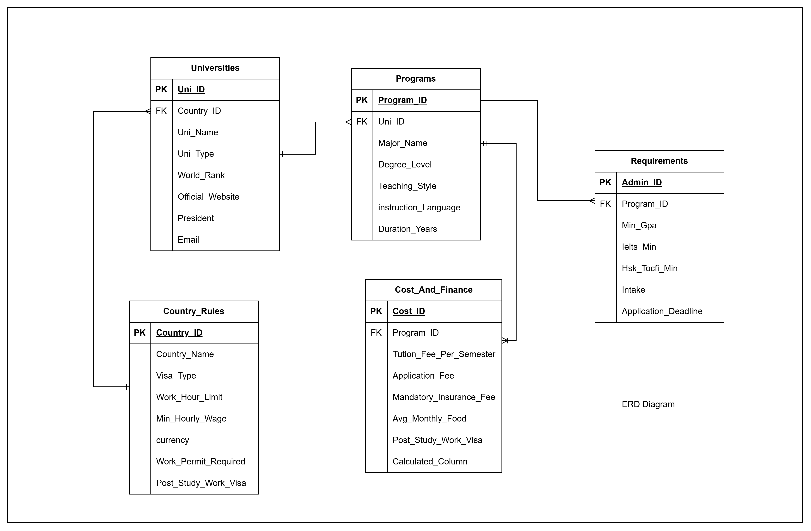

# Data Structure

This document explains how raw, processed, and template data should be organized.

data_entities

universities
- university_id (PK)
- university_name
- country_id (FK)
- city
- university_type
- world_rank (optional)
- official_website
- contact_email (optional)
- teaching_style_score (optional)
- source_url
- last_verified_date

programs
- program_id (PK)
- university_id (FK)
- major_name
- degree_level
- instruction_language
- duration_years
- intake
- application_deadline
- source_url
- last_verified_date

requirements
- requirement_id (PK)
- program_id (FK)
- min_gpa (optional)
- ielts_min (optional)
- hsk_tocfl_min (optional)
- documents_required (optional)
- interview_required (boolean, optional)
- portfolio_required (boolean, optional)
- source_url
- last_verified_date

country_rules
- country_id (PK)
- country_name
- visa_type
- part_time_allowed (boolean)
- work_hour_limit
- work_permit_required (boolean)
- min_hourly_wage (optional)
- currency
- post_study_work_visa (optional)
- visa_notes (optional)
- source_url
- last_verified_date

cost_and_finance
- cost_id (PK)
- program_id (FK)
- tuition_fee_per_semester
- application_fee (optional)
- insurance_fee (optional)
- avg_monthly_living_cost
- currency
- source_url
- last_verified_date

3. RELATIONSHIPS (IMPORTANT)

Use this logic when you redraw ERD:

1. universities → programs
 - university = many programs
2. programs → requirements
 - program = 1 requirements (or 1-to-many if needed)
3. programs → cost
 - program = 1 cost record
4. country_rules → universities
 - country = many universities

Connect via:

universities.country_id → country_rules.country_id

